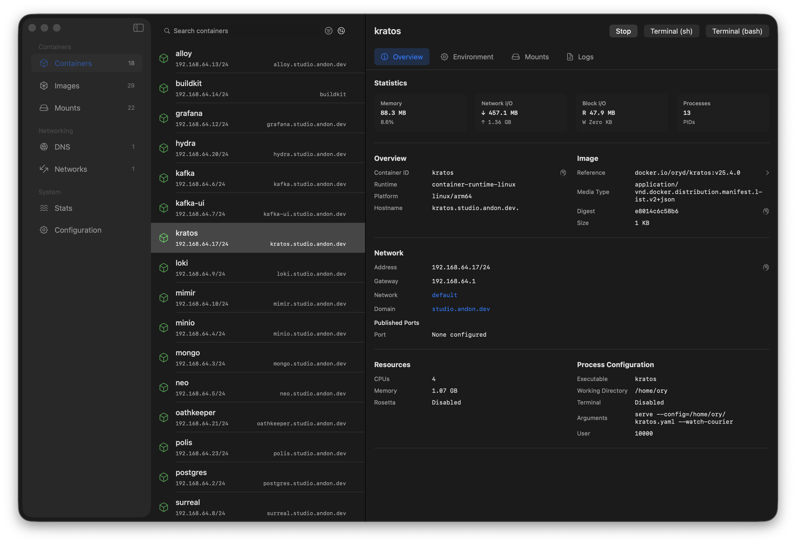
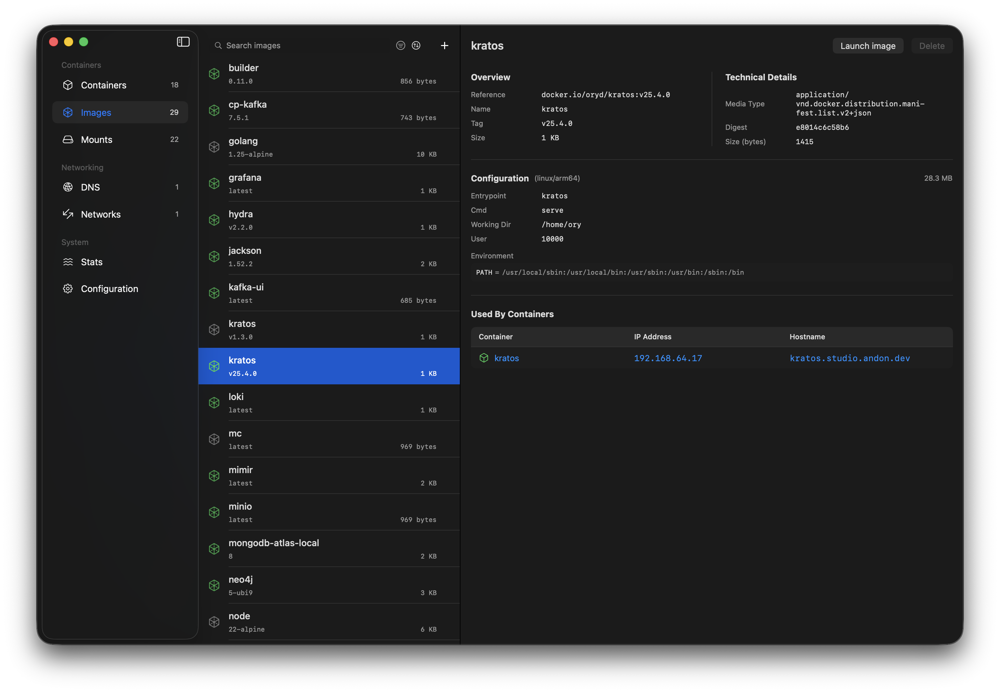
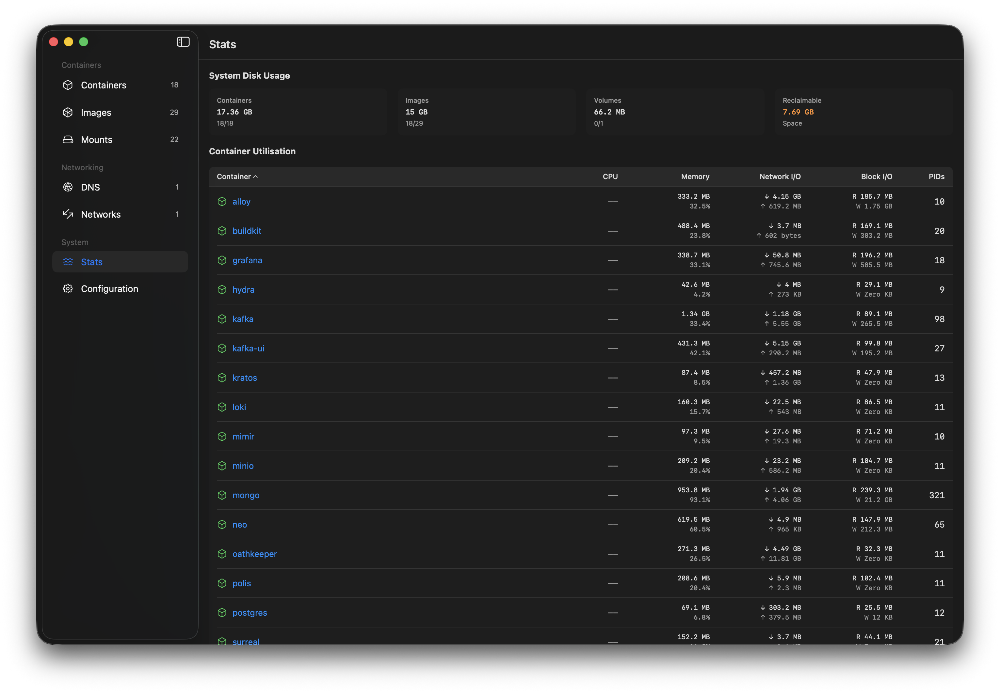

Orchard is a native (Swift) macOS application for managing Linux containers using Apple's [container](https://github.com/apple/container) tooling.

It has been based on years of experience with Docker Desktop, but dedicated to the new containerization option.

The ambition of the project is to make it easy for developers to switch from Docker Desktop to Containers. Orchard gives you a desktop experience that complements the `container` command-line interface.



## Highlights of Containerization

- Made by Apple: Native support, incredible performance and the engineering resources to make it work.
- Sub second startup times
- Kernel isolation by design
- Easier networking - no more port mapping (every container gets its own IP address), networks out of the box

## Features

- Container management: create, start, stop, force stop, delete
- Image management: pull, delete, search Docker Hub
- Network and DNS domain management
- Real-time container stats with sortable columns
- Sortable container and image lists with persistent preferences
- Multi-container log viewer with split panes, filtering, and per-container colour coding
- Container log viewer with search highlighting
- Builder, kernel and system property management
- Menu bar integration



Browse, pull, and delete container images. Search Docker Hub directly from the app and inspect image metadata without dropping to the CLI.


Stream logs from multiple containers side by side. Split panes, filter by text, and use per-container colour coding to keep output readable when debugging across services.



Monitor live CPU, memory, and network usage for running containers. Sortable columns and persistent preferences make it easy to spot resource hotspots at a glance.

## Requirements

- macOS 26 (Tahoe)
- Xcode 26 / Swift 6.2 (for building from source)
- [Apple Container](https://github.com/apple/container) installed - [follow the instructions here](https://github.com/apple/container?tab=readme-ov-file#install-or-upgrade)

## Architecture

Orchard communicates with the container daemon primarily through the `ContainerAPIClient` Swift library (from [apple/container](https://github.com/apple/container)) over XPC. This provides typed Swift APIs for container, image, network, and system operations without shelling out to the CLI.

A small number of operations (system start/stop, builders, DNS domain management, system properties) still use the `container` CLI binary via `Foundation.Process`, as these are not yet exposed through the XPC API.

## Installation

You can install Orchard via homebrew or via a prebuilt release package. You can also download the source and build it yourself!

### Homebrew

```bash
brew install orchard
```

### Release download

1. Download the latest release from [GitHub Releases](https://github.com/andrew-waters/orchard/releases)
2. Open the `.dmg` file and drag Orchard to your Applications folder
3. Launch Orchard from the Apps directory

### Build from Source

```bash
git clone https://github.com/andrew-waters/orchard.git
cd orchard
open Orchard.xcodeproj
```

The project uses Swift Package Manager for dependencies. Xcode will resolve the `apple/container` package automatically on first build.

## License

This project is licensed under the MIT License - see the [LICENSE](LICENSE) file for details.
